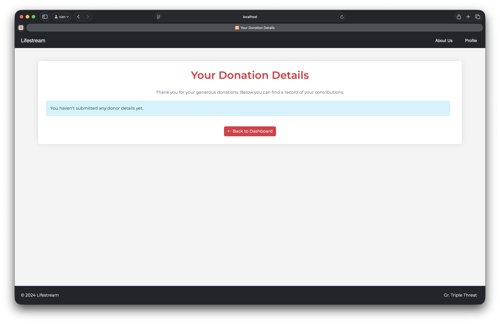

# Blood Donation System

-F37623?style=for-the-badge)

---

# Overview

A **Blood Donation** and **Donor Finder System** made during our Sophomore Year.
It was developed using **PHP** with localhost and phpMyAdmin for database management.

It includes two main roles:
  - **User:** Can register, log in, add donor details, view announcements, and track donation history.
  - **Admin:** Can manage donors and recipients, update collection records, post announcements, and prioritize recipients using a First-Come, First-Served (FCFS) donation sequence.

The project utilizes a **modular structure** that separates registration, dashboard, and database functions, ensuring a clear and organized system flow.
This allows users to easily register, donate, and find compatible blood recipients within a single accessible web interface.

---

# Preview

  
  &nbsp;&nbsp;&nbsp;
  

  
  &nbsp;&nbsp;&nbsp;
  

  
  &nbsp;&nbsp;&nbsp;
  

